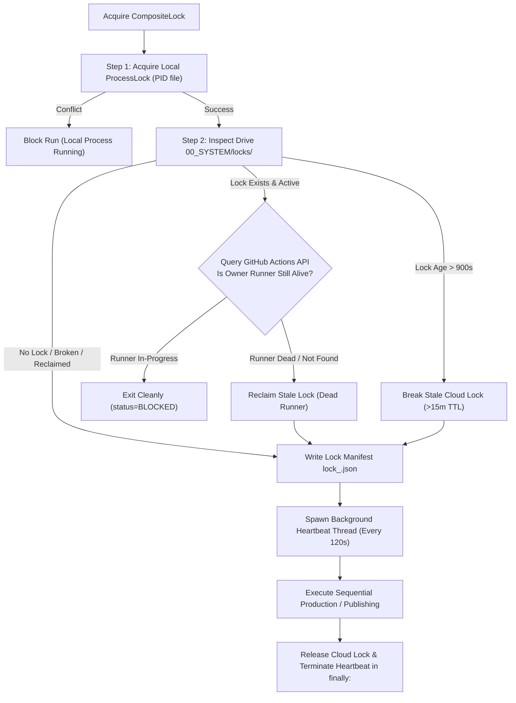

---
aliases:
  - CloudLock
  - Distributed Locking
  - Lock Hardening
tags:
  - architecture
  - locking
  - concurrency
last_updated: 2026-09-07
---

# Distributed Cloud Locking: CompositeLock & CloudLockManager

> **Status:** `[LIVE & HARDENED — COMMIT 31c002c]`  
> **Scope:** Cloud distributed locking, race-condition elimination, deadlock prevention, and dead-runner reclamation `[CODE VERIFIED]`.

---

## 1. The Distributed Concurrency Challenge

Running automated GitHub Actions crons alongside manual workflow dispatches and scheduled publishers creates severe race-condition risks:
- Multiple runners could attempt buffer replenishment simultaneously, duplicating API costs and video renders.
- Multiple publishers could attempt to claim the same Short from `01_READY`.
- Ephemeral runners could crash or be cancelled mid-run, leaving dangling locks that block all future scheduled runs `[HISTORICAL INCIDENT 8]`.

---

## 2. Hardened Architecture (Commit `31c002c`)

Implemented in [`core/cloud_lock.py`](file:///C:/Users/jisha/OneDrive/Desktop/yt%20automation/core/cloud_lock.py):

### Key Hardening Features:
1. **Shorter TTL (900s / 15m):** Reduced from 3600s to 900s, preventing multi-hour lockouts `[CODE VERIFIED]`.
2. **Background Heartbeat (120s):** Long-running video synthesis threads automatically update the lock timestamp every 2 minutes `[CODE VERIFIED]`.
3. **Dead-Runner Reclamation:** Inspects the GitHub Actions API for the lock owner's workflow status. If the runner is completed, cancelled, or missing, the lock is reclaimed immediately `[CODE VERIFIED]`.
4. **Force Unlock Override:** CLI flag `--force-unlock` and workflow dispatch parameter `force_unlock: true` allow operators to clear locks on demand `[LIVE VERIFIED]`.
5. **Non-Crashing Exit:** Lock contention exits with code 0 (`status=BLOCKED`), avoiding false-positive failure alerts in GitHub Actions `[CODE VERIFIED]`.