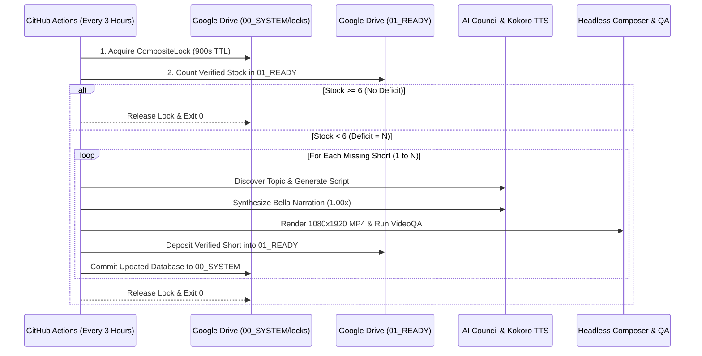

---
aliases:
  - Buffer Replenishment
  - produce_buffer.yml
  - 3-Hour Refill Cron
tags:
  - operations
  - buffer
  - cron
last_updated: 2026-09-07
---

# Buffer Replenishment Workflow (`produce_buffer.yml`)

> **Status:** `[LIVE & RUNNING — 3-HOUR CADENCE]`  
> **Trigger:** Cron `0 */3 * * *` (Every 3 hours UTC) + `workflow_dispatch` `[LIVE VERIFIED]`  
> **Reserve Contract:** Google Drive `01_READY` Target = **6 Shorts** `[LIVE VERIFIED]`  
> **Dynamic Deficit:** `max(0, 6 - actual_01_READY_count)` `[CODE VERIFIED]`  

---

## 1. Workflow Architecture & Triggers

The buffer replenishment engine operates autonomously in GitHub Actions via `.github/workflows/produce_buffer.yml`:

```yaml
on:
  schedule:
    # Autonomous 3-Hour Refill Invariant
    - cron: '0 */3 * * *'
  workflow_dispatch:
    inputs:
      target_buffer:
        description: 'Desired ready buffer count (default 6)'
        required: false
        default: '6'
      force_unlock:
        description: 'Force break cloud lock if stuck'
        required: false
        type: boolean
        default: false
```

---

## 2. Execution Flow



---

## 3. Dynamic Deficit Protection

1. **Idempotent Exit:** If `01_READY` contains 6 Shorts, the workflow exits in <45 seconds with 0 API spend `[CODE VERIFIED]`.
2. **Crash Resilience:** If runner encounters a transient error on Short 2 of 4, Short 1 is already safely vaulted and committed to Drive `01_READY` and `00_SYSTEM` `[CODE VERIFIED]`.
3. **Historical Proof:** GitHub Actions Run #47 (`34054429381`) executed on 2026-09-07, detected deficit, produced Bella Short `short_man_c85a0dd30bda.mp4`, and deposited it to Drive `01_READY` in 14m 26s `[LIVE VERIFIED]`.