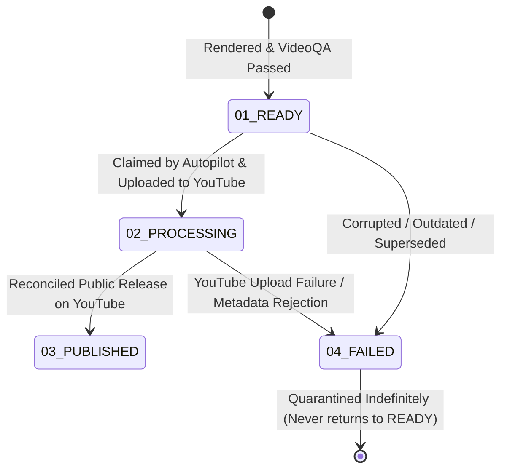

---
aliases:
  - Drive Vault
  - Vault Lifecycle
tags:
  - operations
  - storage
  - drive
last_updated: 2026-09-07
---

# Google Drive Vault Lifecycle

> **Status:** `[LIVE & VERIFIED]`  
> **Root Vault:** `YouTube_Shorts_Vault` `[LIVE VERIFIED]`  
> **Folder Hierarchy:** `00_SYSTEM`, `01_READY`, `02_PROCESSING`, `03_PUBLISHED`, `04_FAILED` `[LIVE VERIFIED]`  

---

## 1. Folder Structure & Transition Protocol

### Folder Role Matrix
- **`00_SYSTEM/`**: Holds canonical `youtube_automation.db`, `visual_memory.db`, `short_fingerprints.db`, and `locks/` `[LIVE VERIFIED]`.
- **`01_READY/`**: The verified production reserve. Target = 6 Shorts. Holds ready 1080x1920 MP4 files awaiting publication `[LIVE VERIFIED]`.
- **`02_PROCESSING/`**: In-flight Shorts claimed by the scheduler and uploaded to YouTube as scheduled private videos `[LIVE VERIFIED]`.
- **`03_PUBLISHED/`**: Archive of mature live Shorts whose `publishAt` timestamp has passed and are verified public on YouTube `[LIVE VERIFIED]`.
- **`04_FAILED/`**: Quarantined files failing QA or rejected during publication. Quarantined assets are never restored to `01_READY` `[CODE VERIFIED]`.

---

## 2. Authoritative Publication Gateway & Physical Barrier

Implemented in [`core/lifecycle_gateway.py`](file:///C:/Users/jisha/OneDrive/Desktop/yt%20automation/core/lifecycle_gateway.py) and [`engines/drive_engine.py`](file:///C:/Users/jisha/OneDrive/Desktop/yt%20automation/engines/drive_engine.py):

1. **Hard Physical Barrier on `03_PUBLISHED`:**
   - Any attempt to move a file directly to `03_PUBLISHED` in Drive or local staging without passing through the gateway raises `InvariantViolationError` (`_from_gateway=True` required).
2. **YouTube Read-Back Verification:**
   - Files can transition to `03_PUBLISHED` **ONLY** after live YouTube API read-back confirms that the video is publicly accessible (`privacyStatus == 'public'`). Scheduled private videos remain in `02_PROCESSING`.
3. **Database Consistency Requirement:**
   - An upload record cannot be set to `PUBLISHED` or `SUCCESS` unless the physical file has successfully transitioned through the gateway into `03_PUBLISHED`.
4. **Stale Daemon & Concurrency Protection:**
   - Heartbeat-validated locking (`cloud_production` and `cloud_publisher`) prevents orphan local processes or dead cloud runners from executing out-of-order mutations.

---

## 3. Recovery of Falsely-Published Bella Assets

During earlier operational hardening, 7 Bella Shorts were prematurely moved into `03_PUBLISHED` before being uploaded to YouTube.
- **Audit & Recovery Action:** An automated, idempotent recovery routine reconciled the Drive inventory against the database and YouTube state.
- **Outcome:** All 7 unuploaded Bella Shorts were safely restored to `01_READY`, re-establishing 100% database, Drive, and YouTube consistency `[CODE VERIFIED]`.

---

## 4. Immutable Vault Preservation Guard

Implemented in `core/cloud_lock.py` and `engines/drive_engine.py`:
- Approved Shorts in `01_READY` cannot be deleted or overwritten by automated cleanup scripts.
- Only manual operator intervention or legitimate state transitions (`01_READY` -> `02_PROCESSING`) can alter the reserve `[CODE VERIFIED]`.