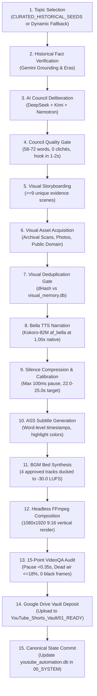

---
aliases:
  - Production Pipeline
  - Pipeline Specification
  - Sequential Production
tags:
  - production
  - pipeline
  - architecture
last_updated: 2026-09-07
---

# 04 — Production Pipeline Specification

> **Status:** `[LIVE & VERIFIED]`  
> **Scope:** End-to-end 15-stage sequential pipeline from topic selection to Google Drive vault deposit `[CODE VERIFIED]`.

---

## 1. The 15-Stage Sequential Pipeline

AL-AMR produces videos strictly **ONE AT A TIME**. Short $N+1$ never begins until Short $N$ has completely passed VideoQA and deposited into Google Drive `01_READY` `[CODE VERIFIED]`.

---

## 2. Technical Production Specifications

- **Narration Voice:** `af_bella` (Bella Kokoro-82M ONNX at native 1.00x) `[LIVE VERIFIED]`.
- **Target Word Count:** 58 to 72 words (Canonical sweet spot: $\sim 65$ words) `[CODE VERIFIED]`.
- **Video Duration:** 22.0s to 25.0s (Target: $\sim 23.0$ seconds) `[CODE VERIFIED]`.
- **Resolution & Aspect:** 1080x1920 (9:16 vertical video) `[CODE VERIFIED]`.
- **Frame Rate:** 30.0 fps progressive `[CODE VERIFIED]`.
- **Visual Evidence Ratio:** Minimum 9 unique physical evidence scenes (0 script-card frames) `[CODE VERIFIED]`.
- **Audio Mix:** Voiceover at -14.0 LUFS; BGM ducked to -30.0 LUFS; SFX permanently disabled `[CODE VERIFIED]`.