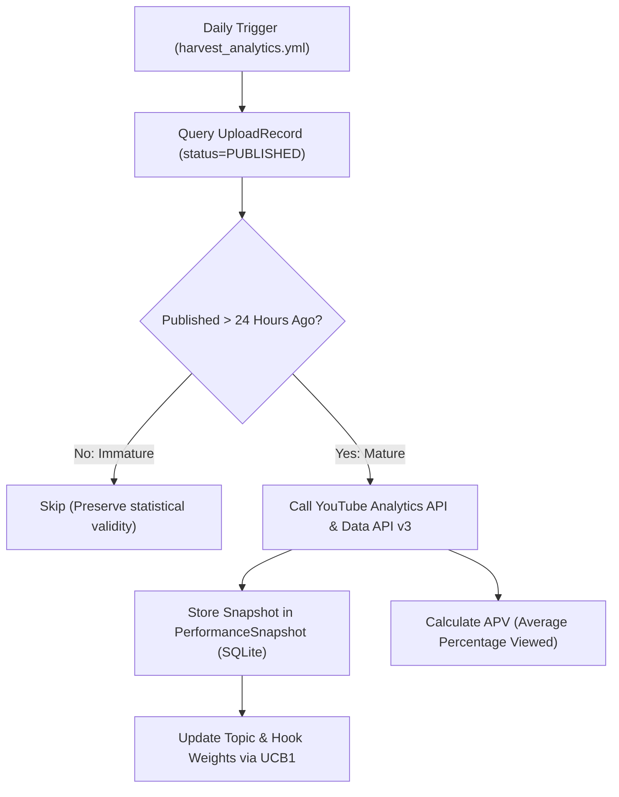

---
aliases:
  - Telemetry & Learning
  - Closed-Loop Learning
  - Analytics Engine
tags:
  - intelligence
  - analytics
  - telemetry
last_updated: 2026-09-07
---

# Closed-Loop Telemetry & Learning Engine

> **Status:** `[LIVE & HARVESTING]`  
> **Telemetry Policy:** Strictly **LIVE CLOUD TRUTH ONLY**; zero hardcoded, synthetic, or fake metrics `[LIVE VERIFIED]`.  
> **Maturation Gate:** Videos must be published for $\ge 24\text{ hours}$ before analytics harvesting `[CODE VERIFIED]`.  

---

## 1. Analytics Harvesting Architecture

Executed by GitHub Actions on scheduled cadence (`harvest_analytics.yml`):

---

## 2. Telemetry Grounding Rule: Zero Fake Data

- The system strictly forbids placeholder views, simulated CTRs, or fabricated retention graphs.
- Every metric stored in `PerformanceSnapshot` originates directly from authenticated Google YouTube Analytics API endpoints.
- If an endpoint returns 0 views (e.g. for newly released Shorts), the raw zero is recorded honestly `[LIVE VERIFIED]`.