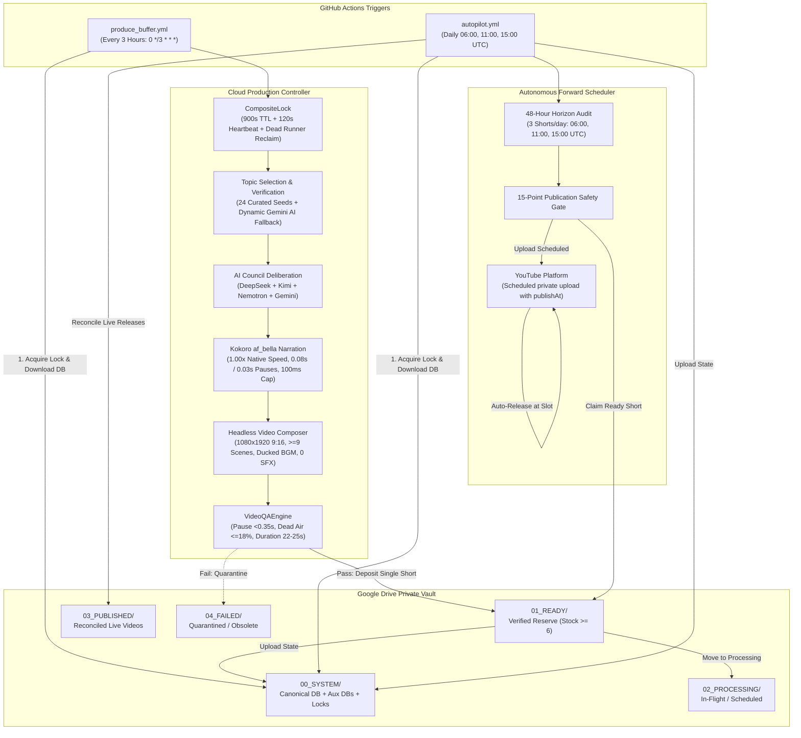

---
aliases:
  - AL-AMR Dashboard
  - Master Dashboard
tags:
  - dashboard
  - status/live
  - system/autonomous
last_updated: 2026-09-07
---

# 🛸 AL-AMR Master Operational Dashboard

> [!IMPORTANT]
> **SYSTEM STATUS: 🟢 LIVE / CLOUD-AUTONOMOUS** `[LIVE VERIFIED]`  
> AL-AMR is a 100% autonomous, 24/7 cloud Shorts production and scheduling operation running unattended on GitHub Actions and Google Drive without depending on a local PC, terminal, or home internet.
> **Canonical 10-Tier Hierarchy:** See [[01 — PROJECT MASTER/Project Overview|01 — PROJECT MASTER]] through [[10 — CHANGELOG/System Master Changelog|10 — CHANGELOG]].

---

## ⚡ Core Operational KPI Card

| Parameter | Specification | Enforcement Mechanism | Status |
|---|---|---|---|
| **System Status** | `🟢 LIVE / CLOUD-AUTONOMOUS` | GitHub Actions cron + Drive `00_SYSTEM` state | `[LIVE VERIFIED]` |
| **Approved Niche** | `History / Historical Mysteries / Bizarre True Historical Events` | Fail-closed programmatic gate `is_niche_compliant` + `CURATED_HISTORICAL_SEEDS` | `[LIVE VERIFIED]` |
| **Banned Content** | `ZERO Politics, War, Military, Diplomacy, Generic Science` | Fail-closed keyword rejection list | `[CODE VERIFIED]` |
| **Authoritative Voice** | **`af_bella` (Bella - US Female at native 1.00x)** | Static voice lock in `TTSEngine` (`af_sarah` decommissioned) | `[LIVE VERIFIED]` |
| **Narration Pacing** | `0.08s sentence` / `0.03s clause` / `100ms cap` | Kokoro pause tuning + silence compression | `[CODE VERIFIED]` |
| **Audio QA Thresholds** | `Max pause < 0.35s` / `Dead air <= 18%` | Hard Audio QA check in `VideoQAEngine` | `[CODE VERIFIED]` |
| **Short Duration** | `22.0s – 25.0s` (Target: `~23.0s`) | Duration calibration loop in `TTSEngine` | `[CODE VERIFIED]` |
| **Script Length** | `58 – 72 words` (Target: ~65 words) | Hard Council Quality Gate in `JournalisticScriptEngine` | `[CODE VERIFIED]` |
| **Scene Density** | `9 minimum` / `10–12 target` unique evidence beats | Manifest quality gate (0 script-card frames) | `[CODE VERIFIED]` |
| **Visual Deduplication** | `Zero intra-Short dupes` + 45-day cooldown | `GlobalVisualMemory` (dHash + SHA256) | `[CODE VERIFIED]` |
| **Story Deduplication** | `No duplicate/near-duplicate topics` | `ShortDuplicateGuard` (title & script shingles) | `[CODE VERIFIED]` |
| **Background Music** | **`ENABLED`** (4 tracks ducked under voice) | EBU R128 Stage B bed (`-30.0 LUFS`), zero SFX | `[CODE VERIFIED]` |
| **Sound Effects (SFX)** | **`PERMANENTLY DISABLED`** | Hard-coded production pipeline flag (`has_sfx=False`) | `[CODE VERIFIED]` |
| **Ready Vault Reserve** | **`6 Verified Shorts`** in `01_READY` | Replenishment audit in `produce_buffer.yml` (Deficit: 5) | `[LIVE VERIFIED]` |
| **Refill Schedule** | **`Every 3 Hours (0 */3 * * *)`** | GitHub Actions cron trigger | `[LIVE VERIFIED]` |
| **Distributed Lock** | **`CompositeLock` (900s TTL, 120s heartbeat, dead-runner check)** | Drive `00_SYSTEM/locks/` (Commit `31c002c`) | `[LIVE VERIFIED]` |
| **Forward Horizon** | **`Rolling 48-Hour Coverage`** | Vacant slot audit in `autopilot.yml` | `[CODE VERIFIED]` |
| **Daily Publish Limit** | **`Strictly 3 Shorts / Day`** | Slots at `06:00, 11:00, 15:00 UTC` | `[CODE VERIFIED]` |
| **Production Mode** | **`Strictly SEQUENTIAL`** (1-by-1) | Render -> QA -> Deposit -> DB Sync before next | `[CODE VERIFIED]` |
| **Execution Layer** | **`GitHub Actions (ubuntu-latest)`** | `produce_buffer.yml` & `autopilot.yml` | `[LIVE VERIFIED]` |
| **State Persistence** | **`Google Drive (00_SYSTEM)`** | Bidirectional SQLite synchronization (`database_sync`) | `[LIVE VERIFIED]` |

---

## 🗺 System Architecture Flow

---

## 📂 Canonical 10-Tier Knowledge Vault Directory

- [[01 — PROJECT MASTER/Project Overview|01 — PROJECT MASTER]]: Vision, Invariants, System Overview & Roadmap.
- [[02 — ARCHITECTURE/Cloud & Storage Topology|02 — ARCHITECTURE]]: 3-Tier Model, Distributed Locking Hardening, Unified Controller, Database Sync.
- [[03 — AUTONOMOUS OPERATIONS/Buffer Replenishment Workflow|03 — AUTONOMOUS OPERATIONS]]: 3-Hour Refill Cron, 48h Forward Autopilot, Drive Vault, Zero-PC Autonomy.
- [[04 — CONTENT PRODUCTION/Production Pipeline Specification|04 — CONTENT PRODUCTION]]: 15-Stage Pipeline, Script Craftsmanship, Bella Voice Spec, Visual Evidence, Audio Standards, Deduplication.
- [[05 — PUBLISHING/Forward Horizon Scheduling|05 — PUBLISHING]]: Forward Horizon Scheduler, Scheduled Upload Protocol, 15-Point Safety Gate.
- [[06 — INTELLIGENCE/Historical Topic Discovery & Curated Seeds|06 — INTELLIGENCE]]: 24 Curated Mystery Seeds, Dynamic AI Fallback, Multi-Agent Council, Telemetry Learning.
- [[07 — MISSION CONTROL/Operational State & Inventory|07 — MISSION CONTROL]]: Operational State, Render Dashboard, Review Queue Hygiene, System Diagnostics.
- [[08 — TESTING/Verification Suite & QA Gates|08 — TESTING]]: 15-Point VideoQA, AudioQA, Targeted Test Suites, AST Compliance.
- [[09 — INCIDENTS & FIXES/Incident Register & Forensic Log|09 — INCIDENTS & FIXES]]: Incidents 1–7 Log, Incident 8 Deep Post-Mortem & Fixes.
- [[10 — CHANGELOG/System Master Changelog|10 — CHANGELOG]]: Authoritative Commit & Milestone Register (Latest: Commit `31c002c`).