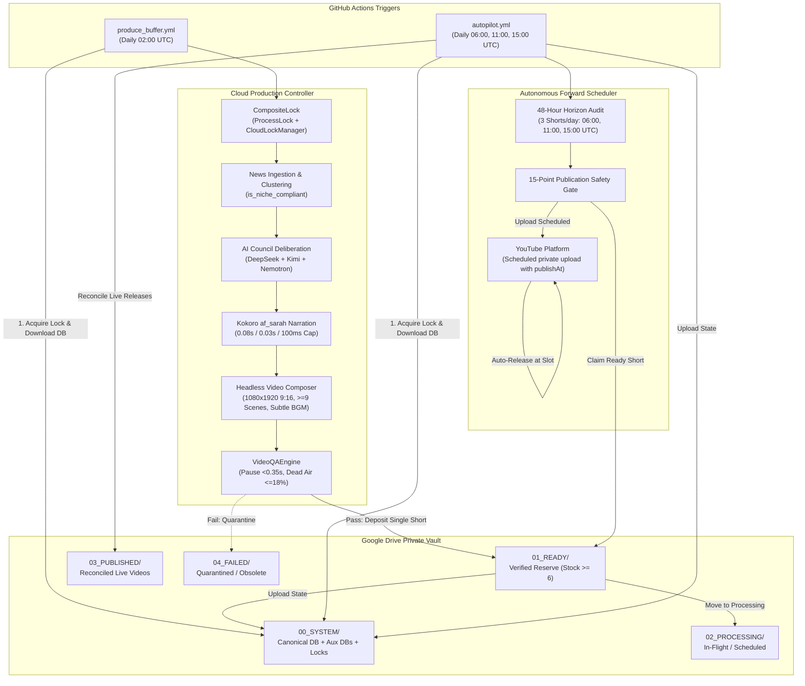

---
aliases:
  - AL-AMR Dashboard
  - Master Dashboard
tags:
  - dashboard
  - status/live
  - system/autonomous
last_updated: 2026-09-05
---

# 🛸 AL-AMR Master Operational Dashboard

> [!IMPORTANT]
> **SYSTEM STATUS: 🟢 LIVE / CLOUD-AUTONOMOUS**  
> AL-AMR is a 100% autonomous, 24/7 cloud Shorts production and scheduling operation running unattended on GitHub Actions and Google Drive without depending on a local PC, terminal, or home internet.

---

## ⚡ Core Operational KPI Card

| Parameter | Specification | Enforcement Mechanism |
|---|---|---|
| **System Status** | `🟢 LIVE / CLOUD-AUTONOMOUS` | GitHub Actions cron + Drive `00_SYSTEM` state |
| **Approved Niches** | `1. Mystery / Bizarre Stories` `2. Weird Science / Real Facts` | Fail-closed programmatic gate `is_niche_compliant` |
| **Banned Content** | `ZERO Politics, War, Military, Diplomacy` | Fail-closed keyword rejection list |
| **Publishing Rotation** | `Day A (2 Mystery + 1 Science)` `Day B (1 Mystery + 2 Science)` | `CloudProductionOrchestrator` balance router |
| **Authoritative Voice** | **`af_sarah` (Sarah - US Female)** | Static voice lock (`af_bella` decommissioned) |
| **Narration Pacing** | `0.08s sentence` / `0.03s clause` / `100ms cap` | Kokoro pause tuning + silence compression |
| **Audio QA Thresholds** | `Max pause < 0.35s` / `Dead air ≤ 18%` | Hard Audio QA check in `VideoQAEngine` |
| **Short Duration** | `22.0s – 25.0s` (Target: `~23.2s`) | Duration calibration loop in `TTSEngine` |
| **Script Length** | `62 – 70 words` (High retention) | Hard Council Quality Gate in `JournalisticScriptEngine` |
| **Scene Density** | `9 minimum` / `10–12 target` unique beats | Manifest quality gate (`direct_evidence_ratio`) |
| **Visual Deduplication** | `Zero intra-Short dupes` + global cooldown | `GlobalVisualMemory` (dHash + SHA256) |
| **Story Deduplication** | `No duplicate/near-duplicate topics` | `ShortDuplicateGuard` (title & script shingles) |
| **Background Music** | **`ENABLED`** (4 tracks ducked under voice) | EBU R128 Stage B bed (`-30.0 LUFS`), zero SFX |
| **Sound Effects (SFX)** | **`DISABLED`** (Permanently retired) | Hard-coded production pipeline flag (`has_sfx=False`) |
| **Ready Vault Reserve** | **`6 Verified Shorts`** in `01_READY` | Replenishment audit in `produce_buffer.yml` |
| **Forward Horizon** | **`Rolling 48-Hour Coverage`** | Vacant slot audit in `autopilot.yml` |
| **Daily Publish Limit** | **`Strictly 3 Shorts / Day`** | Slots at `06:00, 11:00, 15:00 UTC` |
| **Production Mode** | **`Strictly SEQUENTIAL`** (1-by-1) | Render -> QA -> Deposit -> DB Sync before next |
| **AI Council** | `DeepSeek` + `Kimi K3` + `Nemotron` | Multi-agent synthesis & quality evaluation |
| **Execution Layer** | **`GitHub Actions (ubuntu-latest)`** | `produce_buffer.yml` & `autopilot.yml` |
| **State Persistence** | **`Google Drive (00_SYSTEM)`** | Bidirectional SQLite synchronization (`database_sync`) |
| **Current Phase** | **`Operational Observation & Optimization`** | Data-driven iteration based on YouTube telemetry |

---

## 🗺 System Architecture Flow

---

## 📂 Master Knowledge Vault Directory

- [[01 - Vision & Goals|01. Vision & Core Philosophy]] — Mission statement, zero-cost economics, operational autonomy.
- [[02 - Content Strategy|02. Authoritative Content Strategy]] — Approved niches, political rejection gate, rotation cadence.
- [[03 - Architecture|03. Cloud Architecture & Distributed Locking]] — 3-tier segregation, CompositeLock, runners.
- [[04 - AI Council|04. Multi-Agent AI Council Architecture]] — DeepSeek, Kimi K3, Nemotron roles & quality gate.
- [[05 - Script Engine|05. High-Retention Journalistic Scripting]] — 62–70 words, 22–25s target, hook, progression.
- [[06 - Audio & Voice|06. Sarah Voice Lock & Narration Pacing]] — af_sarah, silence compression, audio QA, BGM bed.
- [[07 - Visual System|07. Visual Evidence & Global Visual Memory]] — Real footage, perceptual hashing, scene density.
- [[08 - Duplicate Protection|08. Short Duplicate Guard & Fingerprinting]] — Shingles, topic cooldown, intra-batch dedup.
- [[09 - Production Pipeline|09. Sequential Production & Refill Controller]] — 1-by-1 production invariant, deficit calculation.
- [[10 - Scheduling & Autopilot|10. 48-Hour Forward Horizon Scheduler]] — 3 slots/day, reconciliation, zero immediate uploads.
- [[11 - Cloud Infrastructure|11. GitHub Actions Cloud Execution]] — Runner topologies, workflows, secrets management.
- [[12 - Google Drive Vault|12. Google Drive Vault & Database Persistence]] — 00_SYSTEM through 04_FAILED schema.
- [[13 - QA & Testing|13. Multi-Factor Video & Audio QA System]] — 15-point verification, fail-closed enforcement.
- [[14 - Deployment & Operational State|14. Deployment Status & Live State]] — Git commit 54112e7, health check 9/9, inventory.
- [[15 - Historical Decisions|15. Historical Decisions & Superseded Architectures]] — Bella retirement, politics pivot, BGM restoration.
- [[16 - Roadmap|16. Project Roadmap & Operational Observation]] — Phase completion, performance-driven optimization.
- [[17 - Operational Metrics|17. Closed-Loop Telemetry & YouTube Analytics]] — Retention, APV, swipe rate, strategy weights.