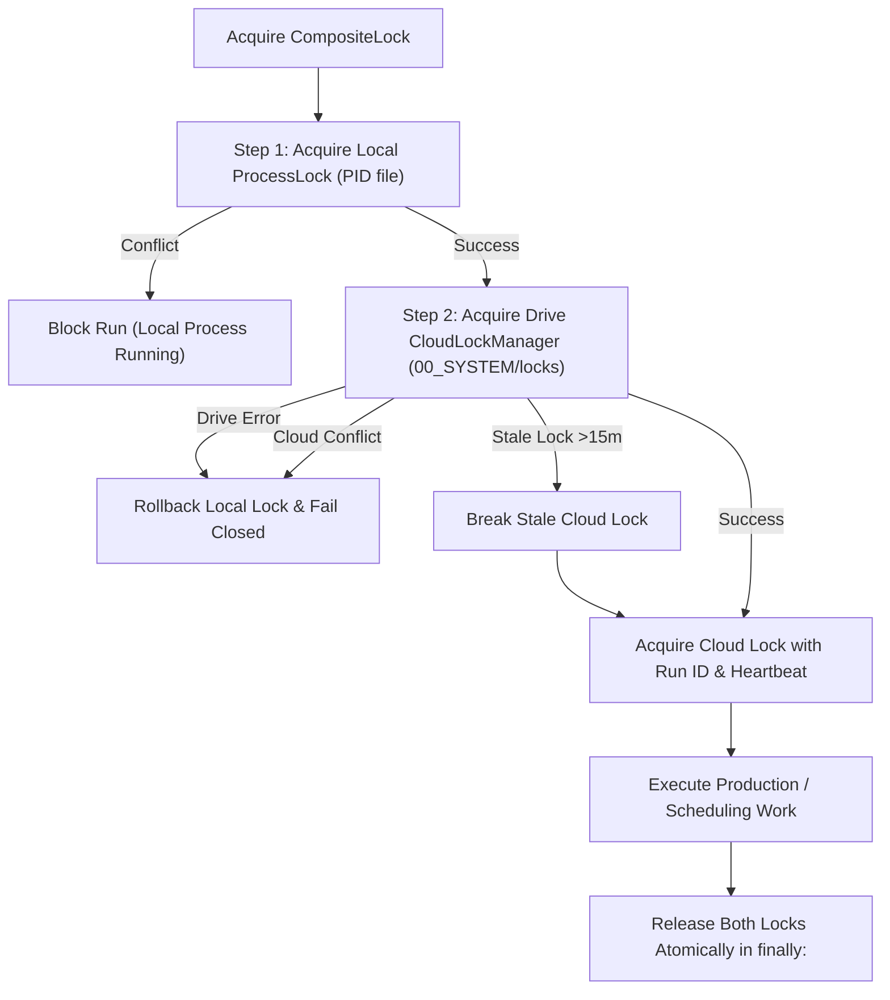

---
aliases:
  - Cloud Architecture
  - System Architecture
tags:
  - architecture
  - cloud
  - locking
last_updated: 2026-09-05
---

# 03 — Cloud Architecture & Distributed Locking

> **Status:** `[LIVE & VERIFIED]`  
> **Scope:** Multi-tier architectural topology, ephemeral runner execution, distributed cloud locking, and database synchronization.

---

## 1. Multi-Tier Architectural Topology

AL-AMR segregates responsibilities across three decoupled layers:

```
+---------------------------------------------------------------------------------------------------+
| THREE-TIER CLOUD ARCHITECTURE                                                                     |
+---------------------------------------------------------------------------------------------------+
| [TIER 1: EPHEMERAL EXECUTION]  GitHub Actions Runners (ubuntu-latest)                            |
|   - Zero persistent local state; spins up on cron schedule.                                      |
|   - Installs FFmpeg, fonts, Python 3.11/3.13, and pip dependencies.                              |
|   - Injects credentials via GitHub Secrets (TOKEN_JSON, CLIENT_SECRET_JSON, API keys).            |
|   - Downloads canonical database from Google Drive, executes work, uploads updated database.     |
|                                                                                                   |
| [TIER 2: CLOUD VAULT & DURABLE STATE]  Google Drive Private Vault (YouTube_Shorts_Vault)        |
|   - 00_SYSTEM/         : Canonical SQLite DB, auxiliary DBs, and distributed lock files.         |
|   - 01_READY/          : Verified reserve of QA-passed 1080x1920 MP4 Shorts (Target >= 6).       |
|   - 02_PROCESSING/     : In-flight Shorts currently scheduled or uploading to YouTube.           |
|   - 03_PUBLISHED/      : Permanent archive of live, reconciled YouTube Shorts.                   |
|   - 04_FAILED/         : Quarantined assets failing QA or safety checks (never re-enter READY).   |
|                                                                                                   |
| [TIER 3: KNOWLEDGE BRAIN]  Obsidian Vault (data/knowledge)                                      |
|   - Authoritative human-readable documentation, decision logs, and operational telemetry.        |
|   - Version-controlled in Git and committed alongside pipeline updates.                          |
+---------------------------------------------------------------------------------------------------+
```

---

## 2. Distributed Locking (CompositeLock & CloudLockManager)

### The Problem
When running automated cron jobs in GitHub Actions alongside occasional manual CLI operations or scheduled publisher workflows, multiple processes can attempt to:
- Simultaneously replenish the buffer, causing duplicate renders or API quota exhaustion.
- Simultaneously claim the same video from `01_READY` for YouTube scheduling.
- Overwrite the SQLite database snapshot in Google Drive with out-of-order state.

### The Solution: `CompositeLock`
Implemented in [`core/cloud_lock.py`](file:///C:/Users/jisha/OneDrive/Desktop/yt%20automation/core/cloud_lock.py):



#### Distributed Consensus Tie-Breaker
If two ephemeral runners attempt to acquire the cloud lock within the same second:
1. Both write a lock manifest `lock_<run_id>.json` containing `timestamp`, `run_id`, `runner_id`, and `ttl_seconds=900`.
2. Both query `00_SYSTEM/locks/` and sort all valid lock files lexicographically by `(timestamp, run_id)`.
3. The runner owning the earliest lexicographical entry wins the lock.
4. The losing runner deletes its lock file, releases its local lock, and exits cleanly (`status=BLOCKED`).

---

## 3. Unified Idempotent Controller (CloudProductionOrchestrator)

To eliminate code divergence, all execution vectors share the single canonical controller [`intelligence/cloud_orchestrator.py`](file:///C:/Users/jisha/OneDrive/Desktop/yt%20automation/intelligence/cloud_orchestrator.py):
- **GitHub Actions Replenishment:** Invokes `CloudProductionOrchestrator.run_production_cycle(target_buffer=6)`.
- **Local Daemon Mode (`python main.py --daemon`):** Runs continuous convergence loop calling `maintain_buffer()` and `schedule_ready_buffer()`.
- **Manual CLI Refill (`python main.py --maintain-buffer 6`):** Delegates directly to `CloudProductionOrchestrator`.

---

## 4. Architectural Links
- System Overview: [[00 - Master Dashboard|AL-AMR Dashboard]]
- Workflows: [[11 - Cloud Infrastructure|Cloud Infrastructure]]
- Drive Vault Schema: [[12 - Google Drive Vault|Google Drive Vault]]
- Production Engine: [[09 - Production Pipeline|Production Pipeline]]