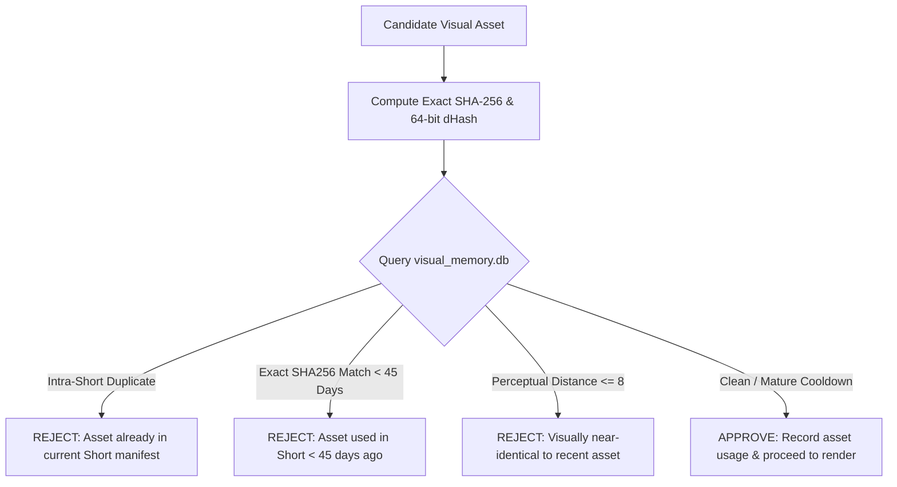

---
aliases:
  - Visual System
  - Visual Memory
  - GlobalVisualMemory
tags:
  - visuals
  - rendering
  - video
last_updated: 2026-09-05
---

# 07 — Visual Evidence & Global Visual Memory

> **Status:** `[LIVE & OPERATIONAL]`  
> **Scope:** Physical visual evidence retrieval, scene density standards, perceptual hashing deduplication, and vertical FFmpeg composition.

---

## 1. Visual Philosophy: Physical Evidence Over Generic Stock

AL-AMR viewers retention depends heavily on visual authenticity. Abstract corporate b-roll or decorative AI animations cause immediate swipe-aways.

```
┌───────────────────────────────────────┬───────────────────────────────────────┐
│ BANNED VISUAL PRACTICES (REJECTED)    │ APPROVED PHYSICAL EVIDENCE (REQUIRED) │
├───────────────────────────────────────┼───────────────────────────────────────┤
│ Generic modern office / typing b-roll │ Actual historical documents / records │
│ Fake slow zooms to inflate scene count│ Real archaeological excavation photos │
│ Same photo repeated with tiny pans    │ Microscope scans / laboratory photos  │
│ Low-resolution / blurry web clips     │ Telescope / satellite imagery         │
│ Low-relevance decorative graphics     │ Authentic museum artifact photographs │
└───────────────────────────────────────┴───────────────────────────────────────┘
```

---

## 2. Scene Density & Beat Specification

- **Target Resolution:** Exactly `1080x1920` (9:16 vertical MP4).
- **Framerate:** `30.0 FPS` progressive scan.
- **Minimum Scene Count:** **`9 unique scenes`** per Short (Hard QA threshold).
- **Target Scene Count:** **`10 to 12 scenes`** (optimal: ~2.1s to 2.4s per scene cut).
- **Anti-Filler Invariant:** Every scene cut must present a distinct visual asset or perspective. Using Ken Burns zoom-in then zoom-out on the same static frame to count as two scenes is explicitly detected and rejected.

---

## 3. GlobalVisualMemory (`visual_memory.db`)

Implemented in [`intelligence/visual_memory.py`](file:///C:/Users/jisha/OneDrive/Desktop/yt%20automation/intelligence/visual_memory.py):

To prevent visual fatigue and cross-Short asset exhaustion, every visual asset ingested into the system is fingerprinted in SQLite:



### Key Metrics Tracked
- `asset_id`: Canonical asset identifier.
- `exact_hash`: SHA-256 checksum for byte-exact duplicate detection.
- `perceptual_hash`: 64-bit difference hash (dHash) computed across grayscale gradients.
- `last_used_at`: Timestamp of most recent appearance in a published or ready Short.
- `usage_count`: Lifetime usage count across the channel catalog.

---

## 4. Subtitle Design & Safe-Zone Typography

- **Format:** Burned-in ASS (Advanced SubStation Alpha) subtitles with word-level highlight animation.
- **Font:** Bold, high-contrast sans-serif (Dejavu Sans / Montserrat style).
- **Safe Zone:** Centered horizontally, positioned strictly between 65% and 82% vertical height to prevent collision with YouTube UI elements (title header, channel avatar, like/comment buttons).
- **Karaoke Highlight:** Active spoken word illuminates in high-contrast yellow/gold (`#FFE600`) while past/future words remain crisp white with black outline (`border=3px`).

---

## 5. Architectural Links
- Master Overview: [[00 - Master Dashboard|AL-AMR Dashboard]]
- Script Alignment: [[05 - Script Engine|Script Engine]]
- Deduplication: [[08 - Duplicate Protection|Short Duplicate Guard]]
- Video QA Gate: [[13 - QA & Testing|QA System]]