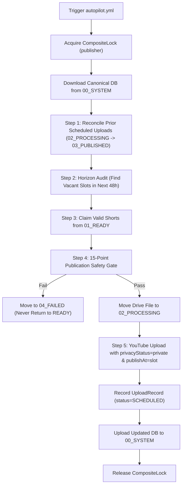

---
aliases:
  - Autonomous Scheduler
  - Scheduling & Autopilot
tags:
  - scheduling
  - autopilot
  - publication
last_updated: 2026-09-05
---

# 10 — 48-Hour Forward Horizon Scheduler

> **Status:** `[LIVE & VERIFIED]`  
> **Scope:** Rolling 48-hour forward horizon audit, 3 daily publication slots, YouTube scheduled releases, and reconciliation loop.

---

## 1. Rolling 48-Hour Forward Horizon Architecture

Unlike naive schedulers that only examine the current day, AL-AMR maintains a continuous **48-hour forward publication buffer**:

```
[NOW: Reference Time UTC]
  │
  ├─► DAY 0 (Today)     : Evaluates 06:00, 11:00, 15:00 UTC slots
  ├─► DAY 1 (Tomorrow)  : Evaluates 06:00, 11:00, 15:00 UTC slots
  └─► DAY 2 (Forward)   : Evaluates forward slots up to NOW + 48 hours
```

Implemented in [`engines/scheduler_engine.py`](file:///C:/Users/jisha/OneDrive/Desktop/yt%20automation/engines/scheduler_engine.py) via `get_vacant_slots_in_horizon()`:
- Inspects all publication slots across Today, Tomorrow, and Day+2 within a rolling 48-hour window.
- Respects the daily ceiling: **`DAILY_SHORTS_LIMIT = 3 Shorts / calendar day`**.
- If Today's 3 slots are already filled, the scheduler seamlessly schedules tomorrow's vacant slots or Day+2 slots.
- Guarantees the channel is never empty, even if cloud production is paused for 48 hours.

---

## 2. Daily Publication Slots (UTC & IST)

| Slot Number | Time (UTC) | Time (IST / Asia/Kolkata) | Target Audience Window |
|---|---|---|---|
| **Slot 1** | `06:00 UTC` | `11:30 AM IST` | Morning APAC / Mid-day Europe commute |
| **Slot 2** | `11:00 UTC` | `04:30 PM IST` | Afternoon Europe / Early morning Americas |
| **Slot 3** | `15:00 UTC` | `08:30 PM IST` | Peak US East Coast / Evening Europe |

---

## 3. Autonomous Scheduling Loop (`schedule_ready_buffer`)

Executed by `.github/workflows/autopilot.yml` at `06:00`, `11:00`, and `15:00 UTC`:



### Zero Immediate Public Uploads
All uploads to YouTube are created with:
- `status.privacyStatus = "private"`
- `status.publishAt = target_slot.isoformat() + "Z"`

YouTube itself executes the public release when the scheduled timestamp arrives. The system never publishes directly to public outside its pre-scheduled calendar slots.

---

## 4. Lifecycle Folder Reconciliation

| Vault Folder | Operational Meaning | Transition Rule |
|---|---|---|
| `01_READY` | Verified production reserve | Short produced and QA passed. |
| `02_PROCESSING` | Scheduled on YouTube / In-flight | Claimed by scheduler; waiting for publishAt time. |
| `03_PUBLISHED` | Publicly released on YouTube | Confirmed live by `reconcile_scheduled_uploads()`. |
| `04_FAILED` | Quarantined / rejected / obsolete | Blocked by safety gate; permanently isolated. |

---

## 5. Architectural Links
- Master Overview: [[00 - Master Dashboard|AL-AMR Dashboard]]
- Production Buffer: [[09 - Production Pipeline|Production Pipeline]]
- Drive Vault Schema: [[12 - Google Drive Vault|Google Drive Vault]]
- Cloud Workflow: [[11 - Cloud Infrastructure|Cloud Infrastructure]]