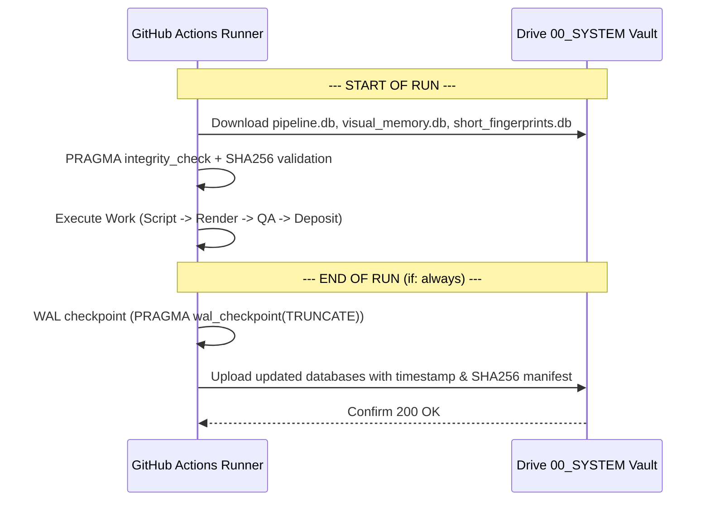

---
aliases:
  - Google Drive Vault
  - Cloud Vault
tags:
  - storage
  - drive
  - vault
  - database
last_updated: 2026-09-05
---

# 12 — Google Drive Vault & Database Persistence

> **Status:** `[CANONICAL SPECIFICATION]`  
> **Scope:** Drive vault folder schema, database synchronization protocol, auxiliary DBs, and the Immutable Preservation Guard.

---

## 1. Vault Hierarchy (`YouTube_Shorts_Vault`)

Google Drive serves as AL-AMR's durable persistent storage layer, maintaining state across ephemeral GitHub Actions runs:

```
YouTube_Shorts_Vault/
├── 00_SYSTEM/                  <-- Durable Cloud State & Database Vault
│   ├── pipeline.db             <-- Canonical relational database (youtube_automation.db)
│   ├── visual_memory.db        <-- GlobalVisualMemory asset dHash & cooldowns
│   ├── short_fingerprints.db   <-- ShortDuplicateGuard title/script shingles
│   └── locks/                  <-- CloudLockManager distributed lock manifests
│
├── 01_READY/                   <-- Staging Reserve for Verified Shorts (Target: 6)
│   └── short_*.mp4             <-- QA-passed, Sarah-narrated, 1080x1920 MP4 files
│
├── 02_PROCESSING/              <-- In-Flight & Scheduled Shorts
│   └── short_*.mp4             <-- Claimed by scheduler; awaiting public YouTube release
│
├── 03_PUBLISHED/               <-- Reconciled Public Releases
│   └── short_*.mp4             <-- Permanent archive of live videos on YouTube
│
└── 04_FAILED/                  <-- Quarantined Assets & Obsolete Artifacts
    └── *.mp4                   <-- Assets failing QA or safety checks (never return to READY)
```

---

## 2. Database Synchronization Engine (`core/database_sync.py`)

Every cloud execution begins by downloading the latest database from `00_SYSTEM/` and ends by uploading the updated state:



---

## 3. The Immutable Preservation Guard

> [!IMPORTANT]
> **PRESERVATION INVARIANT: APPROVED SARAH SHORT IMMUNITY**  
> `short_man_2bf89781983b.mp4` (Drive File ID: `1AEupCriasKzBItqGdOfR3DtjFWMys0_-`, 22.17s, Sarah voice, 0.10s max pause, 4.7% dead air, Council score 8.8/10) is protected by immutable vault policy.

Implemented in [`engines/drive_engine.py`](file:///C:/Users/jisha/OneDrive/Desktop/yt%20automation/engines/drive_engine.py):
- Any attempt by automated cleanup routines or test suites to delete or quarantine this file raises `PermissionError` fail-closed.
- Guarantees the channel reserve always maintains its verified baseline asset.

---

## 4. Quarantined Content Isolation Policy

Any video that fails the 15-Point Publication Safety Gate (e.g. non-authoritative voice, bad audio pauses, duration deviation) is moved to `04_FAILED/`.
- **Fail-Closed Rule:** Files in `04_FAILED/` are never counted toward `01_READY` stock.
- **No Automatic Return:** A file moved to `04_FAILED/` can never be automatically returned to `01_READY` by the scheduler or refill engine.

---

## 5. Architectural Links
- Master Overview: [[00 - Master Dashboard|AL-AMR Dashboard]]
- Architecture: [[03 - Architecture|System Architecture]]
- Workflows: [[11 - Cloud Infrastructure|Cloud Infrastructure]]
- Scheduler: [[10 - Scheduling & Autopilot|Autonomous Scheduler]]