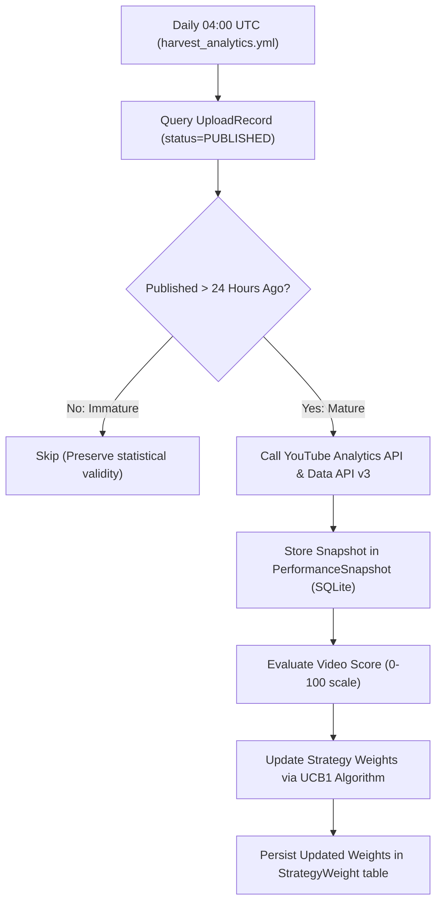

---
aliases:
  - Operational Metrics
  - YouTube Telemetry
tags:
  - metrics
  - analytics
  - telemetry
last_updated: 2026-09-05
---

# 17 — Closed-Loop Telemetry & YouTube Analytics

> **Status:** `[LIVE & HARVESTING]`  
> **Scope:** YouTube Analytics harvesting pipeline, 24h maturation gate, APV/AVD tracking, and closed-loop reinforcement learning.

---

## 1. Analytics Harvesting Architecture

Implemented in [`engines/metrics_collector.py`](file:///C:/Users/jisha/OneDrive/Desktop/yt%20automation/engines/metrics_collector.py) and [`engines/analytics_engine.py`](file:///C:/Users/jisha/OneDrive/Desktop/yt%20automation/engines/analytics_engine.py):

---

## 2. Core Metrics & Evaluation Formula

The closed-loop learning engine scores each mature Short on a normalized 0–100 scale:

$$	ext{Short Score} = (0.45 	imes 	ext{APV}) + (0.25 	imes 	ext{View Count Norm}) + (0.15 	imes 	ext{Engagement Rate}) + (0.15 	imes 	ext{Retention Velocity})$$

| Metric | Business Definition | Target Benchmark |
|---|---|---|
| **APV** | Average Percentage Viewed | $\ge 85.0\%$ |
| **AVD** | Average View Duration | $\ge 19.5$ seconds (on 23s Short) |
| **Viewed vs Swiped Away** | Percentage of viewers choosing to watch | $\ge 70.0\%$ |
| **Engagement Rate** | (Likes + Comments + Shares) / Views | $\ge 4.5\%$ |

---

## 3. Closed-Loop Strategy Weight Adaptation

The learning engine adapts future production parameters without human code changes:
- **Hook Strategy:** Prioritizes question hooks vs paradox hooks based on swipe-away rates.
- **Category Balancing:** Adjusts topic selection probabilities toward higher-retention themes.
- **BGM Mood Weights:** Tracks which background music moods correlate with higher completion rates.

---

## 4. Architectural Links
- Master Overview: [[00 - Master Dashboard|AL-AMR Dashboard]]
- Script Engine: [[05 - Script Engine|Script Engine]]
- Roadmap: [[16 - Roadmap|Project Roadmap]]