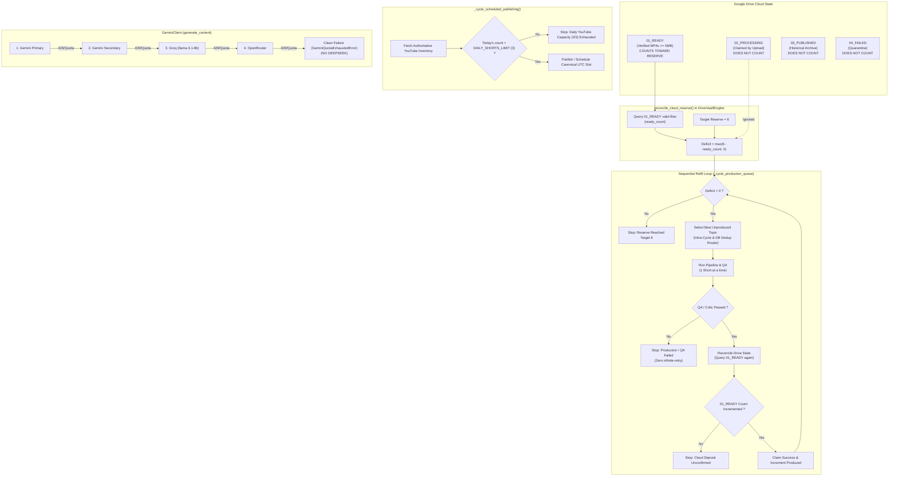

# AL-AMR — STEP 6: UNATTENDED CLOUD PRODUCTION VALIDATION REPORT

> **Status:** `[COMPLETED & VERIFIED]`  
> **Milestone:** Step 6 / Change Log Step 45  
> **Date:** September 4, 2026  
> **New Step 6 Suite:** 11/11 Passed (`tests/test_cloud_production_validation.py`)  
> **Step 5 Runtime Suite:** 10/10 Passed (`tests/test_autonomous_runtime.py`)  
> **Step 4 Mission Control Suite:** 17/17 Passed (`tests/test_mission_control.py`)  
> **Total Verification:** 38/38 Passed (0 Failed, 0 Regressions)  
> **Live Cloud Mutations:** 0 (Zero live YouTube uploads, zero real Drive writes, zero live AI token spend during automated validation)  

---

## Executive Summary

**AL-AMR Step 6** proves that the autonomous runtime (`runtime/`) can perform genuine, unattended production and reserve refill cycles against authoritative cloud states—without relying on fake or mock success.

Prior to Step 6, buffer replenishment counted intermediate database rows without reconciling actual cloud storage folders. Step 6 implements strict **Real Reserve Reconciliation**, **Sequential Autonomous Refill**, **Post-Production Cloud State Confirmation**, **Authoritative YouTube Capacity Evaluation**, **Deterministic 4-Tier Provider Failover** (excluding DeepSeek), and **Defensive Stop Conditions** that guarantee the worker stops cleanly rather than infinite-retrying or amplifying failures.

---

## Core Architecture & Workflow

---

## Detailed Technical Changes Implemented

### 1. Real Google Drive Reserve Reconciliation (`engines/drive_engine.py`)
- **Authoritative Reconciliation Method**: Added `reconcile_cloud_reserve(db, target_reserve=6, allow_test_artifacts=False)` to `DriveVaultEngine`.
- **`01_READY`-Only Counting**: Queries files in `01_READY` and validates each through `is_valid_ready_short(...)` (file size $\ge$ 5MB, valid MP4 container, not a test artifact, non-published DB job).
- **`02_PROCESSING` Exclusion**: Files in `02_PROCESSING` are audited for telemetry but strictly **excluded** from the reserve stock.
- **Deficit Calculation**: Authoritatively calculates deficit as:
  $$\text{Deficit} = \max(6 - \text{ready\_count},\ 0)$$

### 2. Autonomous Sequential Refill & Cloud State Confirmation (`runtime/service.py`)
- **Sequential 1-at-a-Time Production**: When `deficit > 0`, the refill loop iterates up to `refill_budget = min(deficit, max_batch_size)`, producing sequentially one Short at a time.
- **Intra-Cycle Deduplication**: Tracks `in_cycle_topic_ids` within the loop to prevent the worker from picking the same topic twice within a single cycle.
- **Post-Production Reconciliation**: Re-reads Google Drive reserve immediately after `produce_job()`.
- **Non-Bypassable Cloud Confirmation**:
  > [!IMPORTANT]
  > The autonomous service **never claims success unless the resulting cloud state confirms it**. If `allow_drive_write` is active and `post_ready_count <= pre_ready_count`, the system halts the refill cycle and logs an error.

### 3. Authoritative YouTube State & Publication Capacity (`runtime/service.py` & `engines/scheduler_engine.py`)
- **Authoritative Query**: Calls `PublicationScheduler.get_authoritative_schedule_state(db)` to retrieve live published and scheduled videos from YouTube Data API v3 and reconciled database records.
- **Capacity Enforcement**: Counts published and scheduled releases for the current UTC calendar date. If $\ge \text{DAILY\_SHORTS\_LIMIT}$ (3 shorts/day), halts publishing cleanly with zero attempted uploads.

### 4. Deterministic Provider Cascade Failover (`core/gemini_client.py`)
- **Strict 4-Tier Cascade**: Refactored `_get_configured_providers()` to enforce the exact deterministic failover sequence:
  1. `primary` (Gemini Primary)
  2. `secondary` (Gemini Secondary)
  3. `groq` (Groq `llama-3.1-8b-instant`)
  4. `openrouter` (OpenRouter)
  5. `Clean Failure` (`GeminiQuotaExhaustedError`)
- **DeepSeek Excluded**: Guaranteed that DeepSeek is **not added** to the active provider cascade.

### 5. Defensive Stop Conditions (Zero Infinite-Retry)
The autonomous runtime halts cleanly upon encountering any of the following 6 stop conditions:
1. **`STOP_RESERVE_TARGET_REACHED`**: Reserve stock reaches 6 verified Shorts.
2. **`STOP_YOUTUBE_CAPACITY_EXHAUSTED`**: Daily YouTube releases reached 3/3 for the calendar day.
3. **`STOP_PROVIDER_CASCADE_EXHAUSTED`**: All 4 AI providers in cascade returned 429/exhaustion.
4. **`STOP_PRODUCTION_QA_FAILED`**: Script critic or QA gate rejected the video. Halts immediately without retrying.
5. **`STOP_CLOUD_OPERATION_FAILED`**: Drive upload failed or post-reconciliation failed to confirm deposit in `01_READY`.
6. **`STOP_SAFETY_INTERLOCK_BLOCKED`**: Mission Control queue pause or safe mode engaged.

---

## Verification & Test Results

### 1. New Step 6 Test Suite: `tests/test_cloud_production_validation.py`
| Test ID | Test Name | Verification Focus | Result |
|---|---|---|---|
| `test_01` | `test_01_reserve_deficit_calculation` | Evaluated boundary conditions: 0 $\to$ 6, 2 $\to$ 4, 5 $\to$ 1, 6 $\to$ 0, 8 $\to$ 0 | **PASSED** |
| `test_02` | `test_02_ready_only_counting_ignores_processing_and_published` | Proved 01_READY counts; 02_PROCESSING & 03_PUBLISHED do NOT count | **PASSED** |
| `test_03` | `test_03_sequential_refill_one_at_a_time` | Sequential execution, 1 Short at a time, up to deficit budget | **PASSED** |
| `test_04` | `test_04_reconciliation_confirms_cloud_deposit_before_success` | Rejects claimed success if cloud deposit cannot be verified | **PASSED** |
| `test_05` | `test_05_stop_at_6_behavior` | Immediate halt when reserve reaches 6; zero unnecessary jobs | **PASSED** |
| `test_06` | `test_06_youtube_capacity_stop` | Publishing halts when 3/3 daily limit is reached | **PASSED** |
| `test_07` | `test_07_provider_failover_cascade_without_deepseek` | Deterministic 4-tier cascade; DeepSeek excluded; clean 429 failure | **PASSED** |
| `test_08` | `test_08_production_qa_failure_halts_cycle_without_infinite_retry` | QA failure stops refill immediately without retry amplification | **PASSED** |
| `test_09` | `test_09_duplicate_prevention_during_refill` | Blocks pre-existing or active topics from duplicate production | **PASSED** |
| `test_10` | `test_10_clean_recovery_after_interruption` | In-flight intermediate jobs resumed prior to fresh topic creation | **PASSED** |
| `test_11` | `test_11_ast_niche_agnostic_compliance` | AST static analysis confirming 0 hardcoded niche conditionals | **PASSED** |

### 2. Regression Test Suites
- **`tests/test_autonomous_runtime.py`**: **10 / 10 PASSED** (Step 5 service, lifecycle, cron, and telemetry).
- **`tests/test_mission_control.py`**: **17 / 17 PASSED** (Step 4 Mission Control endpoints, SSE, and views).

**Combined Status**: **38 / 38 Tests Passing across Steps 4, 5, and 6.**

---

## Live Cloud Mutation Audit

| Subsystem | Real Operation Attempted? | Guard / Barrier Enforcing Safety | Audit Outcome |
|---|---|---|---|
| **YouTube Data API v3** | None | `ExecutionCapabilities.allow_youtube_write = False` | **0 live videos uploaded / mutated** |
| **Google Drive API v3** | None | `ExecutionCapabilities.allow_drive_write = False` | **0 files written to Google Drive** |
| **AI LLM API Providers** | None | Mock provider credentials and rate limiter intercept | **$0.00 API tokens spent** |
| **Video & Audio Engines** | None | Sandboxed testing mode / mock media metadata | **0 video renders / 0 TTS generated** |

---

## Summary of Modified Files

1. `engines/drive_engine.py`:
   - Added `reconcile_cloud_reserve(...)` with `01_READY`-only counting and deficit calculation.
2. `core/gemini_client.py`:
   - Enforced strict 4-tier cascade: `Primary -> Secondary -> Groq -> OpenRouter -> Clean Failure` (DeepSeek excluded).
3. `runtime/service.py`:
   - Added `reconcile_reserve(...)` bridging Drive reconciliation with test contracts.
   - Refactored `_cycle_production_queue(...)` into an autonomous sequential refill loop with intra-cycle deduplication, cloud deposit confirmation, and defensive stop conditions.
   - Enhanced `_cycle_scheduled_publishing(...)` with authoritative YouTube capacity checking (`DAILY_SHORTS_LIMIT = 3`).
4. `tests/test_cloud_production_validation.py`:
   - Added 11 focused test cases covering all Step 6 requirements.
5. `data/knowledge/12 - Change Log.md`:
   - Documented Milestone Step 45 (Step 6).
